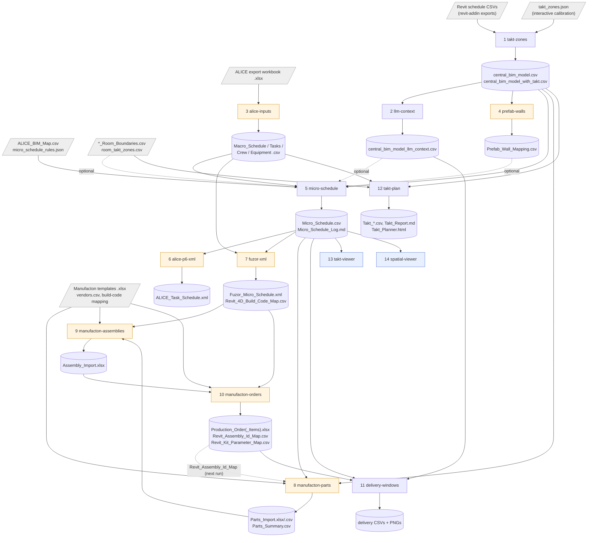

# engines/schedule

Schedule engines: Revit exports → central BIM model with takt zones → macro schedule →
element-level micro schedule → takt plan, deliveries, and the optional ALICE / Fuzor /
Manufacton exports.

Migrated in **P1.7** from ashjs2003/IPD_Challenge@989a6b7. The logic is unchanged: only the
repo-relative paths became CLI arguments (see [Changes against the original](#changes-against-the-original)).
Moving rules and constants into config is P3B.2.

```
engines/schedule/
  core/        takt_zones, llm_context, micro_schedule, takt_planner, delivery_windows
  adapters/    alice/ (macro_inputs, p6_xml), fuzor/ (p6_xml),
               manufacton/ (prefab_wall_mapping, parts_import, assembly_import, kit_import)
  viewers/     takt_viewer, spatial_visualizer (self-contained HTML)
  examples/island/   Island example inputs (plain text, not course data)
  cli.py       concho-schedule <step> ...
```

## Pipeline



Orange = optional tool adapter, blue = HTML viewer, grey = input from outside the pipeline.
Run the steps in the numbered order. Steps 6, 7, 12, 13 and 14 only need the outputs named in
the table, so they can run in any order once those exist.

| # | Step (`concho-schedule …`) | Module | Original script (IPD_Challenge@989a6b7) | Reads | Writes (in `--out-dir`) |
|---|---|---|---|---|---|
| 1 | `takt-zones` | `core/takt_zones.py` | `src/takt_zone_calibrator.py` | all `*.csv` in `--schedules-dir` (Revit exports); `--takt-zones` JSON, or interactively `--plot-schedule` CSVs + `--floor-plan LEVEL=PNG` | `central_bim_model.csv`, `central_bim_model_with_takt.csv` (+ `takt_zones.json` when calibrated interactively) |
| 2 | `llm-context` | `core/llm_context.py` | `src/Planning_engine/generate_llm_bim_context.py` | `central_bim_model_with_takt.csv` | `central_bim_model_llm_context.csv` |
| 3 | `alice-inputs` | `adapters/alice/macro_inputs.py` | `ALICE_BIM_mapper/generate_inputs.py` | ALICE export workbook (sheets `Tasks`, `Crews`, `Equipment`, `Task Crews`, `Task Equipment`) | `Macro_Schedule.csv`, `Tasks.csv`, `Crew.csv`, `Equipment.csv`, `Missing_data.md` |
| 4 | `prefab-walls` | `adapters/manufacton/prefab_wall_mapping.py` | `Prefab_BIM_Mapper/generate_prefab_wall_mapping.py` | `central_bim_model_with_takt.csv` | `Prefab_Wall_Mapping.csv` |
| 5 | `micro-schedule` | `core/micro_schedule.py` | `Micro_Schedule_Generator/generate_micro_schedule.py` | macro schedule, `Tasks.csv`, `Crew.csv`, `Equipment.csv`, `ALICE_BIM_Map.csv`, `central_bim_model_with_takt.csv`; optional: LLM context (discipline lookup), `Prefab_Wall_Mapping.csv`, rules JSON (else built-in rules), `*_Room_Boundaries.csv` | `Micro_Schedule.csv`, `Micro_Schedule_Log.md` |
| 6 | `alice-p6-xml` | `adapters/alice/p6_xml.py` | `ALICE_BIM_mapper/generate_p6_task_schedule_xml.py` | `Micro_Schedule.csv`; optional ALICE workbook (WBS names) | `ALICE_Task_Schedule.xml`, `ALICE_Task_Schedule_Macro_View.csv` |
| 7 | `fuzor-xml` | `adapters/fuzor/p6_xml.py` | `Fuzor_Mapper/generate_fuzor_p6_xml.py` | `Micro_Schedule.csv`, `Tasks.csv`, `Crew.csv`, `Equipment.csv` | `Fuzor_Micro_Schedule.xml` (~16 MB for Island), `Revit_4D_Build_Code_Map.csv` |
| 8 | `manufacton-parts` | `adapters/manufacton/parts_import.py` | `Prefab_BIM_Mapper/generate_parts_import.py` | Manufacton parts template, `central_bim_model_with_takt.csv`, `Micro_Schedule.csv`; optional `Revit_Assembly_Id_Map.csv` of an earlier step-10 run | `Parts_Import.xlsx`, `Parts_Import.csv`, `Parts_Summary.csv` |
| 9 | `manufacton-assemblies` | `adapters/manufacton/assembly_import.py` | `Prefab_BIM_Mapper/generate_assembly_import.py` | Manufacton assembly template, `Parts_Import.xlsx`, `Parts_Summary.csv`, `Micro_Schedule.csv`, `central_bim_model_with_takt.csv`, `Revit_4D_Build_Code_Map.csv` | `Assembly_Import.xlsx` |
| 10 | `manufacton-orders` | `adapters/manufacton/kit_import.py` | `Prefab_BIM_Mapper/generate_kit_import.py` | Manufacton order + item templates, `vendors.csv`, `4d_build_code_to_assembly_id_mapping.csv`, `Assembly_Import.xlsx`, `Parts_Summary.csv`, `Revit_4D_Build_Code_Map.csv`, `Micro_Schedule.csv`, LLM context | `Production_Order.xlsx`, `Production_Order_Items.xlsx`, `Revit_Assembly_Id_Map.csv`, `Revit_Kit_Parameter_Map.csv` |
| 11 | `delivery-windows` | `core/delivery_windows.py` | `Logistics_Analysis/compare_delivery_windows.py` | `Micro_Schedule.csv`, LLM context, the four step-10 outputs | `delivery_units_by_micro_schedule.csv`, `delivery_window_daily_timeseries.csv`, `delivery_window_summary_metrics.csv`, `production_order_count_by_delivery_window.csv`, 7 PNG charts |
| 12 | `takt-plan` | `core/takt_planner.py` | `src/Takt_engine/takt_planner.py` | `central_bim_model.csv`, `room_takt_zones.csv`, `Crew.csv`; optional `Equipment.csv`, productivity rates CSV (else built-in), `*_Room_Boundaries.csv`, FBX | `Takt_Zones.csv`, `Takt_Schedule.csv`, `Takt_Crew_Idle_Report.csv`, `Takt_Element_Allocations.csv`, `Takt_Element_Splits.csv`, `Takt_Equipment_Inputs.csv`, `Takt_Productivity_Rates.csv`, `Takt_Report.md`, `Takt_Zone_Map_<level>.png`, `Takt_Planner.html` (+ `Takt_Model_Viewer.html` with `--fbx`) |
| 13 | `takt-viewer` | `viewers/takt_viewer.py` | `Micro_Schedule_Generator/generate_takt_viewer.py` | `Micro_Schedule.csv`; optional ALICE workbook | `Micro_Schedule_Takt_Viewer.html` |
| 14 | `spatial-viewer` | `viewers/spatial_visualizer.py` | `src/Planning_engine/generate_spatial_visualizer.py` | `Micro_Schedule.csv`; optional `--floor-plan LEVEL=PNG` | `spatial_visualizer_micro.html` |

Relative original paths are under `src/Planning_engine/` unless they start with `src/`.

**Tool-free core.** Steps 1, 2, 5 and 12 need no ALICE, Fuzor or Manufacton licence. Step 5
also accepts a hand-written `Macro_Schedule.csv` (`task_id, task_name, start_date,
end_date`) plus `Tasks.csv` / `Crew.csv` / `Equipment.csv`. It also accepts an ALICE export
CSV with `Task ID, Task Name, Start Date, End Date` (like
`examples/island/Fuzor_Schedule_Template.csv`), but then keeps only rows with
`WBS Outline <= "1.3.3"` (21 of that file's 33 tasks; finding 7).
Two exceptions today: step 11 (`delivery-windows`) needs the Manufacton outputs, and
`prefab-walls` sits in the Manufacton adapter although step 5 uses it (see
[Findings](#findings-kept-as-is-for-phase-3b)).

## Install and run

```bash
pip install -e ".[schedule]"   # pandas 2.3.3 pinned: the micro schedule fails under pandas 3
concho-schedule                # lists the steps
concho-schedule micro-schedule --help
```

Every step is also `python -m engines.schedule <step> …` or
`python -m engines.schedule.<package>.<module> …` (e.g. `python -m engines.schedule.core.micro_schedule`).
Outputs go only to `--out-dir`; nothing is written inside the package.

Island example run. `IPD` is a checkout of IPD_Challenge@989a6b7 (for the Revit exports and
the `.xlsx` files); `EX` is `engines/schedule/examples/island`:

```bash
IPD=/path/to/IPD_Challenge; EX=engines/schedule/examples/island; OUT=out/schedule
PE=$IPD/src/Planning_engine; MF=$PE/Prefab_BIM_Mapper/inputs
concho-schedule takt-zones --schedules-dir $IPD/revit_schedules/Current \
    --takt-zones $IPD/outputs/takt_zones/takt_zones.json --out-dir $OUT/model
concho-schedule llm-context --central-bim-with-takt $OUT/model/central_bim_model_with_takt.csv --out-dir $OUT/model
concho-schedule alice-inputs --workbook $PE/ALICE_BIM_mapper/inputs/ALICE_macro.xlsx --out-dir $OUT/alice
concho-schedule prefab-walls --central-bim-with-takt $OUT/model/central_bim_model_with_takt.csv --out-dir $OUT/prefab
concho-schedule micro-schedule --macro-schedule $OUT/alice/Macro_Schedule.csv --tasks $OUT/alice/Tasks.csv \
    --crew $OUT/alice/Crew.csv --equipment $OUT/alice/Equipment.csv --bim-map $EX/ALICE_BIM_Map.csv \
    --central-bim-with-takt $OUT/model/central_bim_model_with_takt.csv \
    --llm-context $OUT/model/central_bim_model_llm_context.csv \
    --prefab-wall-mapping $OUT/prefab/Prefab_Wall_Mapping.csv --rules $EX/micro_schedule_rules.json \
    --room-boundaries $IPD/revit_schedules/04_Island_ARCH_Concept2_Room_Boundaries.csv --out-dir $OUT/micro
concho-schedule takt-plan --level "L 1" --rooms-per-zone 2 --central-bim $OUT/model/central_bim_model.csv \
    --room-takt-zones $IPD/outputs/room_boundaries/room_takt_zones.csv --crew $OUT/alice/Crew.csv \
    --equipment $OUT/alice/Equipment.csv \
    --productivity-rates $IPD/src/Takt_engine/outputs/Takt_Productivity_Rates.csv \
    --room-boundaries $IPD/revit_schedules/04_Island_ARCH_Concept2_Room_Boundaries.csv --out-dir $OUT/takt
# adapters, delivery windows and viewers: see tests/schedule/test_schedule_equivalence.py
# (_migrated_args) for the full Island argument list of all 14 steps.
```

## Inputs

**Committed Island examples** (`examples/island/`). These are plain-text team configuration,
**not course data and not licensed data**. They are the Island rules and mappings, tuned to
the bamboo design:

| File | Used by | Content |
|---|---|---|
| `micro_schedule_rules.json` | `micro-schedule --rules` | split rules (by level / room) and dependency constraints (chains, serial, same-start, 7-day curing lags) |
| `ALICE_BIM_Map.csv` | `micro-schedule --bim-map` | ALICE task → BIM selectors (`Category:…, Family:…, Type:…, Level:…, discipline:…`), productivity, unit, crew/equipment dependency |
| `vendors.csv` | `manufacton-orders --vendors` | Manufacton template id per building system |
| `4d_build_code_to_assembly_id_mapping.csv` | `manufacton-orders --mapping` | Fuzor build code → Manufacton assembly id (Island prefab walls) |
| `Fuzor_Schedule_Template.csv` | not read by any script | ALICE schedule export (CSV, 33 tasks) that was used as the Fuzor import template; accepted by `--macro-schedule` (ALICE column format, WBS filter applies) |

**Not committed.** The CLIs take these paths as arguments:

| Input | Needed by | Where to get it |
|---|---|---|
| ALICE export workbook (`ALICE_macro.xlsx`, `ALICE_Macro_with_crews_equipment_productivity.xlsx`) | `alice-inputs`, optional for `alice-p6-xml`, `takt-viewer` | export from ALICE (project → export to Excel); Island: IPD_Challenge `src/Planning_engine/ALICE_BIM_mapper/inputs/` and `…/ALICE_VARIATIONS/` |
| Manufacton templates `Parts Import.xlsx`, `Assembly.Import.xlsx`, `ORDER IMPORT TEMPLATE.xlsx` (sheet `ORDERS`), `ITEM IMPORT TEMPLATE.xlsx` (sheet `ITEMS`) | steps 8–10 | Manufacton import templates (download in Manufacton); Island copies: IPD_Challenge `src/Planning_engine/Prefab_BIM_Mapper/inputs/`. `Kit Import.xlsx` there is not read by any script |
| `Fuzor_Schedule_Format.xml` | not read by any script (reference P6 XML layout for Fuzor) | IPD_Challenge `src/Planning_engine/Fuzor_Mapper/inputs/` |
| Revit schedule exports (`*_Architecture_TakeOff.csv`, `*_Structural_Schedule.csv`, `*_MEP_TakeOff.csv`, `*_Room_Boundaries.csv`) | `takt-zones`, `micro-schedule`, `takt-plan` | the Revit add-in in `revit-addin/`; Island: IPD_Challenge `revit_schedules/` (`Current/` = the set used for the central model) |
| `takt_zones.json` | `takt-zones --takt-zones` | output of an interactive `takt-zones` run; Island: IPD_Challenge `outputs/takt_zones/` |
| `room_takt_zones.csv` | `takt-plan` | **no generator in IPD_Challenge@989a6b7** (committed output only, `outputs/room_boundaries/`); columns listed in `takt-plan --help` |
| cropped floor plan PNGs | interactive `takt-zones`, `spatial-viewer` | cropped from the architectural PDFs with IPD_Challenge `src/floor_plancropper.py` (a notebook cell using PyMuPDF; **not migrated** because the calibrator does not import it); Island: `floor_plans/` |
| FBX model | optional `takt-plan --fbx` | Revit FBX export; binary, never committed (`*.fbx` is git-ignored) |

## Tests

- `tests/schedule/test_schedule_pipeline.py` (runs in CI): all 14 steps run through
  `concho-schedule` on an invented mini project (`tests/schedule/mini_project.py`), plus the
  ALICE workbook conversion. The Manufacton templates are generated with the column layout
  the adapters check.
- `tests/schedule/test_schedule_equivalence.py` (needs the IPD_Challenge@989a6b7 checkout:
  `IPD_CHALLENGE_DIR`, or `IPD_Challenge` in the P2.1 fixture folder from
  `scripts/fetch_fixtures.py`; runs in the CI job `reference`, skipped elsewhere): runs the original scripts in a temporary copy of the
  checkout and the migrated CLIs on the same inputs. Every CSV/MD/HTML/XML/xlsx output of
  all 14 steps must match; only run-root paths, the random P6 GUIDs and the relative FBX
  link are masked. It also checks the §1 reference checksums (see below).
- `tests/schedule/test_schedule_migration_diff.py` (same checkout): compares each migrated
  module with its original as an AST. Only path constants, the listed path/`None`-guard
  functions and the new CLI functions may differ.

```bash
IPD_CHALLENGE_DIR=/path/to/IPD_Challenge pytest tests/schedule   # ~2.5 min
# or: python scripts/fetch_fixtures.py && pytest tests/schedule
```

**Reference checksums (roadmap §1).** Checked on 2026-09-26 with pandas 2.3.3:

| File | Reproduced from the 989a6b7 inputs? |
|---|---|
| `Macro_Schedule.csv` | yes, byte-identical (`d267a9…`) |
| `Takt_Schedule.csv` | yes, byte-identical (`17fa80…`) with `--rooms-per-zone 2` |
| `central_bim_model_with_takt.csv` | yes (`ff0087…`) after the `source_schedule` column's machine-specific folder prefix is replaced by the committed one |
| `Micro_Schedule.csv` | **no**, neither by the original code nor by the migrated code: the committed file predates the committed central BIM model (commit c071034 changed all of them at once). The committed run has 93 micro-task nodes / 6,457 rows, and its Ceiling task covers 3 plain ceilings; today's model gives 123 nodes / 6,625 rows, with 95 ceiling elements (mostly ceiling parts). Pinned as a strict `xfail`. |

The committed `central_bim_model_llm_context.csv` (2,556 rows × 24 columns) and
`Prefab_Wall_Mapping.csv` (750 rows) are also older than the code (which gives 3,971 × 33 and
801). P2.6 should pin the regenerated outputs. Island facts from the regenerated run:
37 macro tasks, 2029-10-01 → 2030-07-05; micro schedule 2029-10-01 09:00 → 2030-03-15 19:40;
takt plan L 1 has 16 zones and 192.36 working hours.

## Changes against the original

Allowed in P1.7, and checked by `test_schedule_migration_diff.py`:

- Every path constant that walked up the IPD_Challenge layout (`PROJECT_DIR`, `BASE_DIR`,
  `ROOT = parents[3]`, `ALICE_BIM_MAPPER_DIR`, `outputs/…`) became a module global that
  `configure(...)` sets from CLI arguments / function parameters. Output file names are
  unchanged and go to `--out-dir`.
- Inputs the original tolerated missing (it checked `path.exists()`) are optional
  arguments. Where needed, the check became `path is None or not path.exists()` (micro
  schedule: LLM context, prefab mapping, rules; takt plan: equipment, productivity rates;
  `alice-p6-xml` / `takt-viewer`: ALICE workbook; `manufacton-parts`: assembly id map;
  `takt-zones`: takt zones JSON).
- One CLI per step (`main(argv)`) and the `concho-schedule` dispatcher.

Deviations to review:

1. **Newest-file globs → explicit paths.** The micro schedule and takt planner used the
   newest `revit_schedules/*_Room_Boundaries.csv` (by mtime) and the takt planner the newest
   `revit_schedules/*.fbx`; these are now `--room-boundaries` / `--fbx`. The calibrator's
   `revit_schedules/Current/*.csv` is now `--schedules-dir`.
2. **Read-and-overwrite inputs split.** The takt planner read `Takt_Productivity_Rates.csv`
   from its own output folder and wrote it back; now `--productivity-rates` (input) and
   `OUT_DIR/Takt_Productivity_Rates.csv` (output). The calibrator read and wrote
   `outputs/takt_zones/takt_zones.json`; now `--takt-zones` (input) and, after interactive
   calibration, `OUT_DIR/takt_zones.json`. `manufacton-parts` read the
   `Revit_Assembly_Id_Map.csv` of the previous step-10 run from the shared outputs folder;
   now `--assembly-id-map`.
3. **Hardcoded Island file names → arguments.** Calibrator plot schedules (Arch V24 + Struct
   V3 `Architecture_TakeOff`) → `--plot-schedule`; floor plans (`floor_plans/L-1.png`, …)
   and the spatial viewer's cropped PNGs → `--floor-plan LEVEL=PNG`. The calibrator's
   unused `BIM_SCHEDULE_PATHS` / `*_STRUCTURAL_*` / `MEP_SCHEDULE_PATH` constants and the
   Fuzor adapter's unused `INPUTS_DIR` were dropped.
4. **`alice-inputs` and `spatial-viewer` create `--out-dir`** (the originals wrote into
   existing folders).
5. **`delivery-windows` requires the four Manufacton outputs**, because the original crashes
   without them (finding 2 below). Its code is unchanged.
6. **ALICE BIM map.** The micro schedule preferred `Micro_Schedule_Generator/inputs/ALICE_BIM_Map.csv`
   over `ALICE_BIM_mapper/inputs/ALICE_BIM_Map.csv`; only the first exists at 989a6b7, and it
   is `--bim-map` (committed as `examples/island/ALICE_BIM_Map.csv`).
7. **The takt planner's HTML writers stay in `core/takt_planner.py`**, not in `viewers/`, so
   the logic stays in one file; JSON output instead of HTML is P3B.4.
8. **Lint.** The migrated modules keep their original style; `pyproject.toml` has per-file
   ruff ignores for them (E501, I001, B007, B023, B905, F841, F821 only in `takt_zones.py`).
   Cleanup is left to Phase 3B.
9. Strings that still name the old layout were kept verbatim: the micro schedule log header
   and the spatial viewer subtitle mention `Micro_Schedule_Generator/…`, and `Missing_data.md`
   says `ALICE_macro.xlsx`.

## Fixed in P3B.8

Bug fixes to the original code, one commit each. Every fixed function is listed in
`P3B8_CHANGED_FUNCTIONS` of `test_schedule_migration_diff.py`; the equivalence test compares
each step in isolation (on the original run's intermediate files), so a fix only changes the
outputs of the step it fixes. The chained effect on the Island outputs is pinned in
`tests/fixtures/schedule_golden.json`.

**Fix 1: takt-zone polygons keep their last corner** (`core/takt_zones.py`,
`assign_takt_ids`). `MplPath(corners, closed=True)` uses the last vertex only as the "close"
code and ignores its coordinates, so a zone clicked with N corners was tested as N−1 corners
(the drawing used matplotlib's `Polygon` patch, which closes the ring itself, so the plot
looked right). The Island `takt_zones.json` stores open rings (19 zones, none closed). The
fix repeats the first corner before building the path; an already closed ring only gets a
zero-length edge. Island effect: 901 of the 3,971 elements change zone (the P1.7 estimate):
900 elements without a zone get one (L -1 230, L 0 277, L 1 394; mostly mullions, duct
fittings, walls and ducts) and one duct fitting (1293125) moves from L 1 Zone 5 to L 1
Zone 1; none loses its zone. Elements with a takt id: 1,876 → 2,776. The takt plan does not
read `takt_id` (it groups `room_takt_zones.csv`), so it is unchanged (16 zones, 192.36 h). The
micro schedule only copies `takt_id` (931 rows change); the Island rules split by level and
room, not by takt zone, so no date, duration or row changes. Downstream only the copied
column changes: LLM context (901 rows), `Prefab_Wall_Mapping.csv` (272 rows), the delivery
units' `takt_zones` (172 rows) and the takt viewer (4,442 → 4,630 lines). Test:
`test_takt_zone_polygon_uses_every_corner`.

## Findings (kept as-is, for Phase 3B)

1. ~~**Takt-zone polygons lose their last corner**~~ — fixed in P3B.8 (fix 1, see
   [Fixed in P3B.8](#fixed-in-p3b8)).
2. **`delivery-windows` crashes without Manufacton outputs.** Without production orders,
   `load_delivery_units()` returns micro-schedule units without a `source` column, and
   `production_order_window_series()` raises `KeyError: 'source'`, after most CSVs and PNGs
   are written.
3. **`manufacton-orders` fails on the IPD_Challenge@989a6b7 data** (original and migrated):
   `Build code not found in 4D build-code map: Exterior Wall Install | L -1 | PREFAB_WALL_LNEG1_001`.
   The static `4d_build_code_to_assembly_id_mapping.csv` expects prefab group ids that the
   current prefab mapping (801 rows) no longer produces. Run on its own against the committed
   intermediate files, `manufacton-assemblies` fails too (`Missing part catalog id for
   MEP_ELECTRICAL_FIXTURES_…`). So the committed Manufacton workbooks cannot be regenerated
   from 989a6b7.
4. **pandas 3 breaks the micro schedule** (`TypeError: Invalid value '1440372' for dtype
   'float64'` in `assign_room_takt_ids`); pandas 2.3.3 emits a FutureWarning there. The
   `schedule` extra therefore pins pandas 2.3.3.
5. **Dead code**: `takt_zones.save_prefab_mapping()` uses an undefined
   `PREFAB_MAPPING_OUTPUT_PATH` and is never called. `build_prefab_wall_mapping()` in the
   calibrator duplicates `adapters/manufacton/prefab_wall_mapping.py`. In the micro schedule,
   `INITIAL_SITE_TASK`, `PARALLEL_SITE_TASKS_AFTER_FENCING`, `EARLY_SITE_CHAIN_TASKS`,
   `FOUNDATION_*_TASKS`, `BASEMENT_SUPPORT_TASKS`, `cycle_sort_key`,
   `envelope_support_ready_time`, `previous_level` and `max_defined_timestamps` are unused
   (the rules JSON replaced them).
6. **The core depends on adapters**: the micro schedule reads the prefab wall mapping, and
   the delivery analysis reads the Manufacton orders (P3B.5/P3B.6).
7. `load_macro_schedule()` filters ALICE exports with a **string** comparison
   `WBS Outline <= "1.3.3"`, so e.g. `1.10` sorts before `1.3.3`.
8. The takt planner's `--rooms-per-zone` defaults to 1, but the committed Island plan was
   made with 2.

## Island-specific assumptions in the code (input for P3B.2)

**Micro schedule** (`core/micro_schedule.py` + `examples/island/`):
- Task names are hardcoded throughout. `DEFAULT_MICRO_RULES` (used when no `--rules` is
  given) and `micro_schedule_rules.json` encode the Island sequence: fencing → six parallel
  site tasks → laydown → excavation → shoring → subgrade → footings ‖ basement retaining
  walls → (7 days curing) → foundational columns → grade beams → slab on grade → rocking
  walls; retaining walls → waterproofing → underground utilities → backfill (7-day lag),
  then the superstructure, envelope and interiors per level, then MEP start-up → TAB →
  integrated testing → final inspections → hurricane contingency buffer.
- **Curing:** `BASEMENT_RETAINING_WALL_CURING_DAYS = 7` (also `lag_days: 7` in the JSON).
- **Bamboo / level-by-level parallelization:** columns → beams → floor chained per level
  (`match_by: level`), roof after beams; envelope (exterior wall → glass/mesh) per level
  after the superstructure; interior walls ‖ MEP rough-in per level, ceiling per room.
  `Rocking Walls` (`Type:Bamboo- 8"`) is a foundation-chain task. Parallelism =
  crew or equipment count; room/zone flow is limited to that many concurrent zones.
- `filter_task_specific_elements()` special-cases `roof`, `floor` (floor parts on
  `Roof` vs. other levels), the basement structural tasks (only `Structural_Schedule.csv`),
  basement non-BIM tasks, footings (`footing` in family/type, not `slab`) and slab on grade.
- The exterior wall task installs whole prefab groups (host wall + curtain panels/mullions);
  the glazing task skips prefab-attached panels.
- Non-BIM tasks become one element on level `Basement / Site`, lasting the whole macro window.
- Calendar: Monday–Friday, no holidays; crew hours come from `Crew.csv` (ALICE calendars
  "default calendar" = 9–17 h, "5dx10hr" = 8–18 h in `macro_inputs.calendar_hours`). Tasks
  start at 09:00; an element that fits in a day is not split across days.
- `ALICE_BIM_Map.csv` selects by Island family/type names (`Timber-Column`, `Glulam-Western
  Species`, `TJL Wood Open Web Joist`, `Storefront - EXTERIOR ISLAND`, `MESH WITH FRAME`,
  `Folding_Wall_-_One_Side_-_Single_Panel_2349`, …) and levels `L 0`, `L 1`, `Roof`
  (replaced by Uniformat linking in P3B.3).

**Takt planner** (`core/takt_planner.py`):
- **Level 1 only** by default (`--level "L 1"`, `group_rooms(level_filter="L 1")`);
  `LAST_ZONE_IDS = {"L 1 Takt Zone 8"}` forces that zone to the end.
- Fixed trade sequence Interior Walls → MEP → Ceiling → Doors → Interior Finishes, with
  default rates (1 EA, 45 EA, 750 SF, 20 EA, 300 SF per crew-hour; the Island rates file
  overrides them with 1/1/1/1/50).
- Trades come from Revit categories (`classify_tasks`): interior walls are `Walls` with
  "interior" in the type name.
- Start anchor 2030-01-02 09:00; hours per day = longest crew calendar (default 8);
  minimum task duration 0.25 h.

**Takt zones / prefab walls:** levels `L -1`, `L 0`, `L 1` for calibration; exterior host
walls are recognized by `EXTERIOR` in the type name; curtain panels/mullions within 0.5 ft
of a wall's bounding box join its prefab group.

**Adapters:**
- Manufacton `parts_import` / `assembly_import`: hardcoded Island prefab wall assemblies
  (`SL1-3R`, `SL1-2R`, `SL0W-LNEG1C`, "South-L1-3 rooms", "South-L0-Workshop … South-L-1-Classrooms").
  They are emitted even for other projects, as the mini-project test shows. Also
  `Structural Bamboo` material matching and a 400 CF concrete truck assembly.
- `vendors.csv`: "Bambu Pueblo" as the superstructure vendor.
- Fuzor: `EQUIPMENT_COST_FALLBACK` (crane 350/h, …) and `TASK_RESOURCE_DEFAULTS` for
  "Frame: Beams" / "Exterior Wall Install".
- ALICE P6 XML: default calendar Monday–Friday 09:00–16:59; project id "ALICE Task Schedule".

**Delivery windows:** 1-day / 3-day / 1-week windows, 400 CF concrete truck loads.

**Viewers:** the spatial viewer only colours "Frame: Columns + Beams", "Floor" and "Roof"
("Superstructure Spatial Playback"). Without an ALICE workbook, the takt viewer groups tasks into
phases by Island task-name keywords (`fencing`, `bleacher`, `rocking`, `mesh`, `tab`, …).

## Credit

Originally developed by Ashmitha Jaysi Sivakumar in ashjs2003/IPD_Challenge (commit 989a6b7);
migrated in P1.7.
